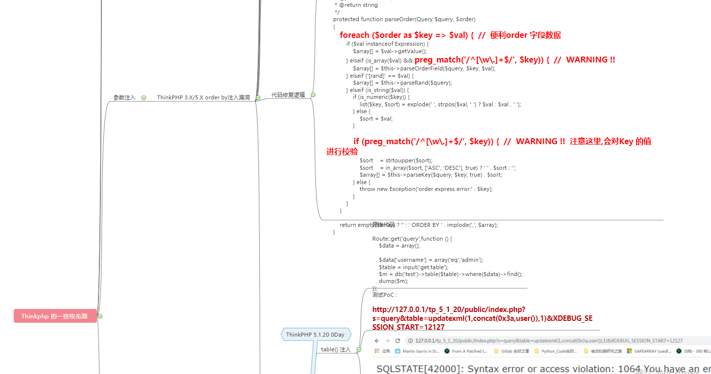
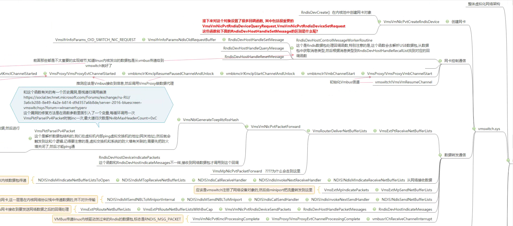
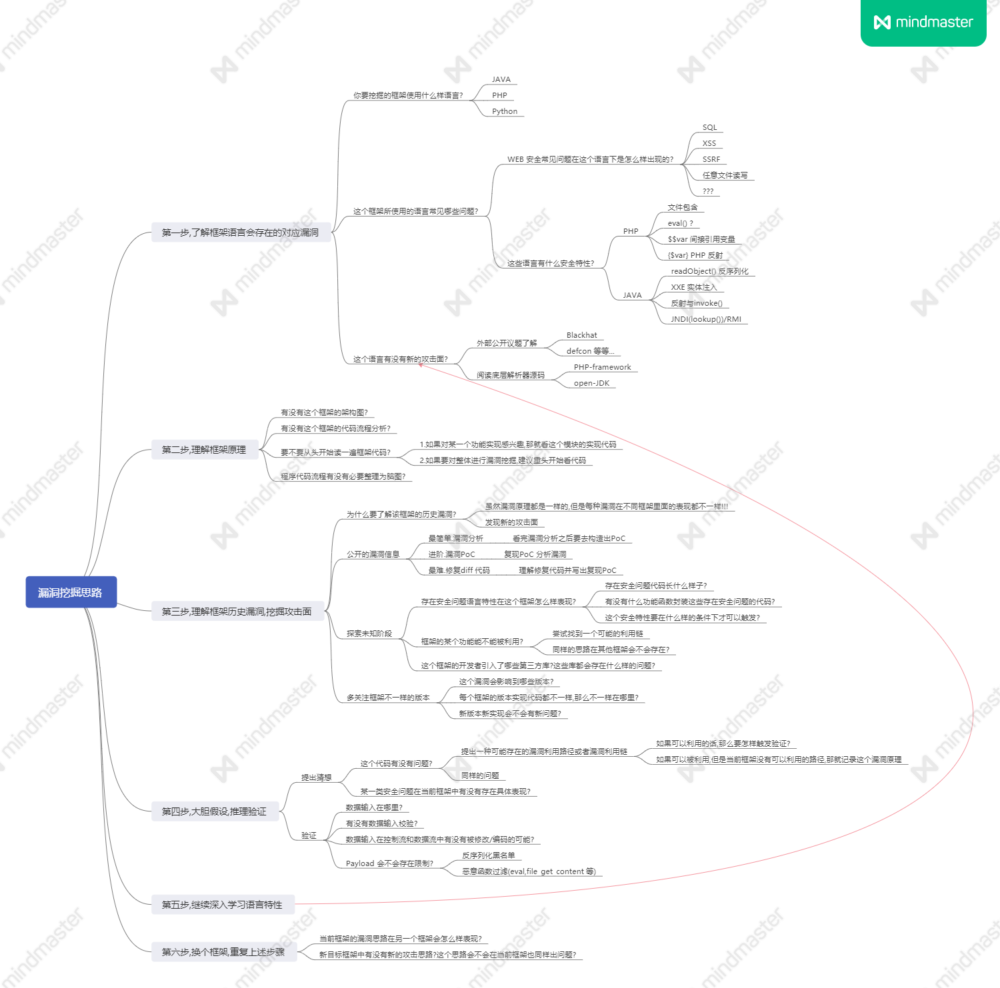

## How to Read Source and Fuzzing

  1-4 章主要是一些阅读源码和Fuzzing 编写经验,章节里面结合了大量真实的例子,包括阅读源码和Fuzzer 编写的例子

  5-6 章主要介绍程序分析的原理

  8-10 章更进一步深入符号执行的工具

  附录1 主要介绍使用工具进行Fuzzing

  附录2 主要介绍从零开始如何编写Fuzzer

  附录3 主要介绍从零开始编写一个符号执行工具

  [1.Github](1.Github.md)

  [2.Fuzzing 模糊测试之数据输入](2.Fuzzing%20%E6%A8%A1%E7%B3%8A%E6%B5%8B%E8%AF%95%E4%B9%8B%E6%95%B0%E6%8D%AE%E8%BE%93%E5%85%A5.md)

  [3.Fuzzing 模糊测试之异常检测](3.Fuzzing%20%E6%A8%A1%E7%B3%8A%E6%B5%8B%E8%AF%95%E4%B9%8B%E5%BC%82%E5%B8%B8%E6%A3%80%E6%B5%8B.md)

  [4.阅读源码](4.%E9%98%85%E8%AF%BB%E6%BA%90%E7%A0%81.md)

  [5.程序编译原理](5.%E7%A8%8B%E5%BA%8F%E7%BC%96%E8%AF%91%E5%8E%9F%E7%90%86.md)

  [6.静态程序分析原理](6.%E9%9D%99%E6%80%81%E7%A8%8B%E5%BA%8F%E5%88%86%E6%9E%90%E5%8E%9F%E7%90%86.md)

  [7.动态程序分析原理](7.%E5%8A%A8%E6%80%81%E7%A8%8B%E5%BA%8F%E5%88%86%E6%9E%90%E5%8E%9F%E7%90%86.md)

  [8.玩转LLVM](8.%E7%8E%A9%E8%BD%ACLLVM.md)

  [9.KLEE符号执行框架](9.KLEE%E7%AC%A6%E5%8F%B7%E6%89%A7%E8%A1%8C%E6%A1%86%E6%9E%B6.md)

  10.Driller:Fuzzing 和符号执行的结合  --  正在更新

  [12.深入解析libfuzzer与asan.md](12.%E6%B7%B1%E5%85%A5%E8%A7%A3%E6%9E%90libfuzzer%E4%B8%8Easan.md)

  13.逻辑漏洞自动化实践,检验逻辑漏洞主要思路是判断状态是否在预期之内(对于不同类型的漏洞来说,都属于有限状态机),比如越权漏洞,用cookie控制请求状态与机器学习算法识别页面的输出是否有敏感数据(非敏感数据不认为是有效的信息泄漏).

  -- 附录 --

  [P1.Fuzzing ImageMagick](https://github.com/lcatro/Fuzzing-ImageMagick/blob/master/%E5%A6%82%E4%BD%95%E4%BD%BF%E7%94%A8Fuzzing%E6%8C%96%E6%8E%98ImageMagick%E7%9A%84%E6%BC%8F%E6%B4%9E.md)

  P2.WASM Fuzzer 编写实例  --  正在更新

  [P3.符号执行与智能合约审计 for KCON & TenSec](P3%20Ethereum%20智能合约自动化审计议题投稿.pptx)

  [P4.REX 框架与Auto Exploit Generation 符号执行原理](P4%20REX%20框架与Auto%20Exploit%20Generation%20符号执行原理.md)

  P5.脑图挖洞案例,快速且低成本地从零开始弄懂框架与漏洞在框架中的表现形式

  脑图预览:

  Think代码分析.emmx (使用MindMaster打开,值得一读)

  hyper-v vmswitch debug.emmx (使用MindMaster打开,值得一读)

  -- 快速上手挖洞思路概述 --

